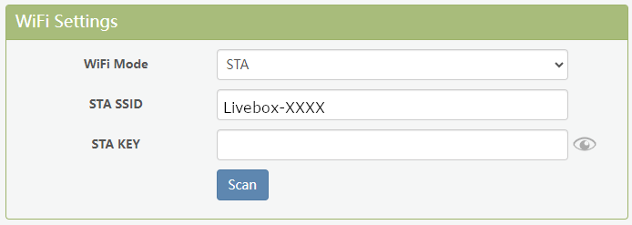
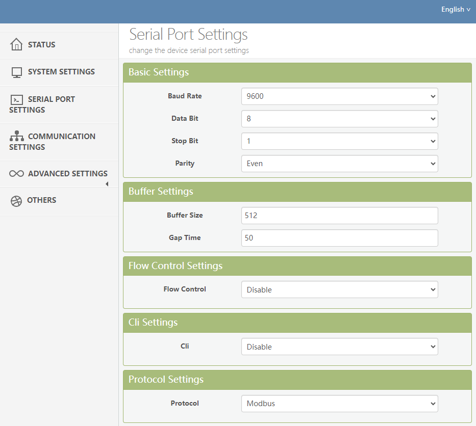
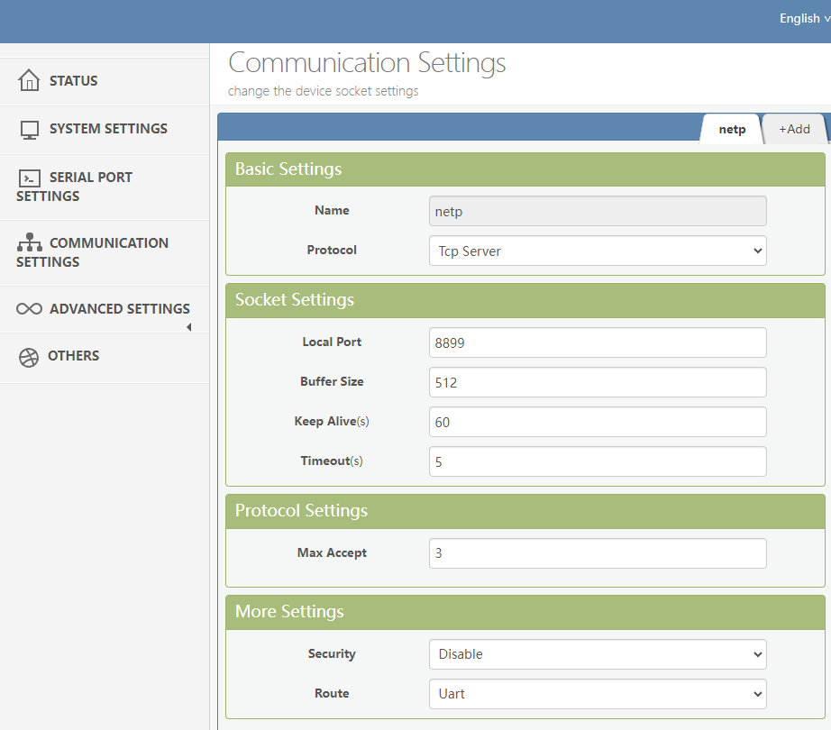

# Elfin EW11A Configuration

The Elfin-EW11 provides RS485 interface to Wi-Fi connectivity. The Elfin-EW11 integrate TCP/IP controller, memory, high-speed serial port and integrates a fully developed TCP/IP network stack and mbed OS. 
Elfin-EW11 also support remotely configure, monitor with IOTService.  
The Elfin-EW11 using highly integrated hardware and software platform, it has been optimized for all kinds of applications in the industrial control, smart grid, personal medical application and remote control that have lower data rates, and transmit or receive data on an infrequent basis. 

## Characteristics
* Support 802.11bgn Wireless Standard
* Support TCP/UDP/Telnet /Modbus TCP Protocol
* Support RS232/RS485 to Wi-Fi Conversion, Serial Speed Up to 230400 bps
* Support STA/AP/AP+STA Mode
* Support SmartLink V8 Smart Config (Provide APP)
* Support Easy Configuration Through Web Interface or PC IOTService Tool
* Support Security Protocol Such As TLS/AES/DES3
* Support Webpage OTA Wirelss Upgrade
* Support Internal PCB Antenna

## STA Mode

Product can be set as a wireless STA and AP as well. And logically, it supports two wireless interfaces, one is used as STA and the other is AP. 
Other STA devices can join into the wireless network through AP interface. So the it can provide flexible networking method and network topology. 

## RS485 Configuration

## TCP Configuration

