# koolnova-BMS-Integration

[](https://github.com/hacs/integration)
[](https://github.com/sinseman44/koolnova-BMS-Integration/blob/main/LICENSE)
[](https://github.com/sinseman44/koolnova-BMS-Integration/releases)
<br />

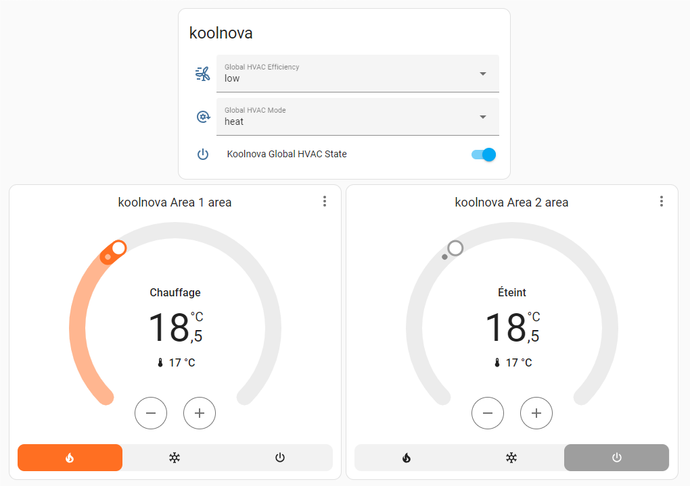

_Disclaimer : This is not a Koolnova official integration and use at your own risk._

**koolnova-BMS-Integration** is an integration of koolnova system into Home Assistant using BMS (Building Management System) and Modbus RTU (RS485) protocol.

## Building Management System (BMS)

With BMS, owners can monitor and manage systems, such as air conditioning, heating, ventilation, lighting or energy supply systems.
Some objectives of building automation are improved occupant comfort, efficient operation of building systems, reduction in energy consumption, reduced operating and maintaining costs and increased security.

Most building automation networks consist of a primary and secondary bus which connect high-level controllers with low-level controllers, input/output devices and a user interface.
Physical connectivity between devices waq historically provided by dedicated optical fiber, ethernet, ARCNET, RS-232, **RS-485** or a low-bandwidth special purpose wireless network.

## Modbus RTU

**Modbus** is a client/server data communications protocol in the application layer of the OSI model. Modbus was developped for industrial applications, is relatively easy to deploy and maintain compared to other standards, and places few restrictions on the format of the data to be transmitted.

Communication standards or buses which is deployed for Modbus communication are:
* TCP/IP over Ethernet
* Asynchronous serial communication in a wide range of standards, technologies : EIA/TIA-232-E, EIA-422, EIA/TIA-485-A, fiber, radio frequency.
* Modbus PLUS, a high speed token passing network

Modbus standard defines MODBUS over Serial Line, a protocol over the Data link layer of the OSI model for the Modbus application layer protocol to be communicated over a serial bus. Modbus Serial Line protocol is a master/slave protocol which supports one master and multiple slaves in the serial bus.
A serial bus for Modbus over Serial Line can maximum 247 slaves to communicate with 1 master, those slaves then must their unique address range from 1 to 247.
Modbus over Serial Line has two transmission modes RTU and ASCII which are corresponded to two versions of the protocol, known as Modbus RTU and Modbus ASCII.

Modbus RTU (Remote Terminal Unit), makes use of a compact, binary representation of the data for protocol communication. The RTU format follows the commands/data with a cyclic redundancy check checksum as an error check mecahnism to ensure the reliability of data.

## Modbus TCP

Modbus TCP/IP (also Modbus-TCP) is simply the Modbus RTU protocol with a TCP interface that runs on Ethernet.
Modbus TCP/IP uses TCP/IP and Ethernet to carry the data of the Modbus message structure between compatible devices. That is, Modbus TCP/IP combines a physical network (Ethernet), with a networking standard (TCP/IP), and a standard method of representing data (Modbus as the application protocol). Essentially, the Modbus TCP/IP message is simply a Modbus communication encapsulated in an Ethernet TCP/IP wrapper. 

# Support

<a href="https://www.buymeacoffee.com/sinseman44" target="_blank"></a>

# Todo 📃 and Bug report 🐞

See [Github To Do & Bug List](https://github.com/sinseman44/koolnova-BMS-Integration/issues)

# Getting Started

## Architecture

Two different architectures, a first wired one where the Koolnova system is connected to the Home Assistant server via a USB/RS485 dongle and a second one wirelessly, the Koolnova system is connected to the RS485/WIFI device which is connected to the same WIFI network as the Home Assistant server.

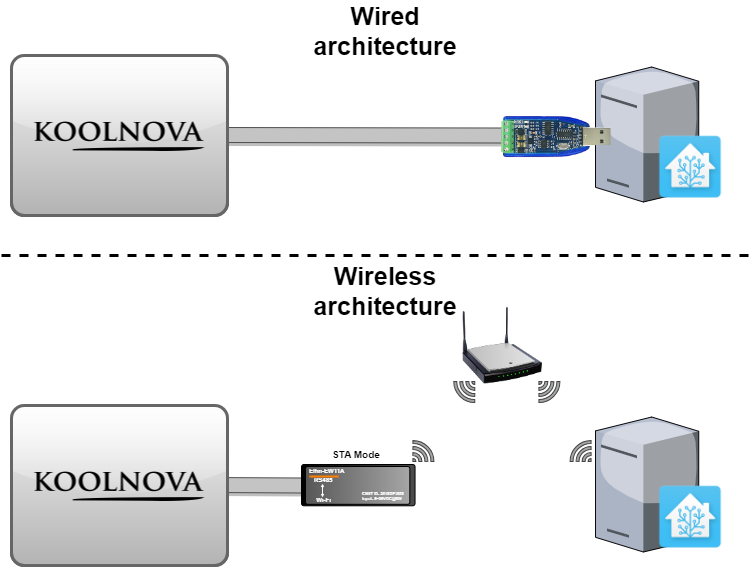

_In IEEE 802.11 (Wi-Fi) terminology, a station (abbreviated as STA) is a device that has the capability to use the 802.11 protocol. For example, a station may be a laptop, a desktop PC, PDA, access point or Wi-Fi phone. An STA may be fixed, mobile or portable._

## Requirements

* An installation of Home Assistant with free USB port.
* A RS485 USB dongle (Example: DSD Tech SH-U11) for wired systems or a RS485/WIFI device (Example: Elfin EW11A or Elfin EW11-0, [example of configuration](EW11-config.md)) for wireless systems.
* A Koolnova air conditioning system (identifier: 100-CPNR00 or 100-CPND00) with areas defined.
* Enabling Modbus communication on the master radio thermostat (INT 49).

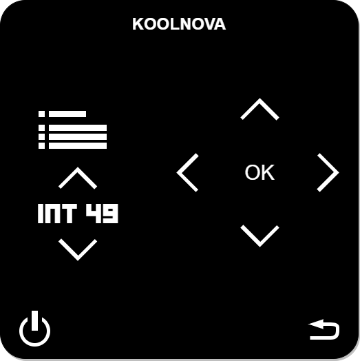

> [!WARNING]
> If you choose the RS485/WIFI device from Elfin, it must accept voltages between ___5v and 36v___.

## Connecting

### with koolnova 100-CPNR00 control unit and RS485 USB Dongle

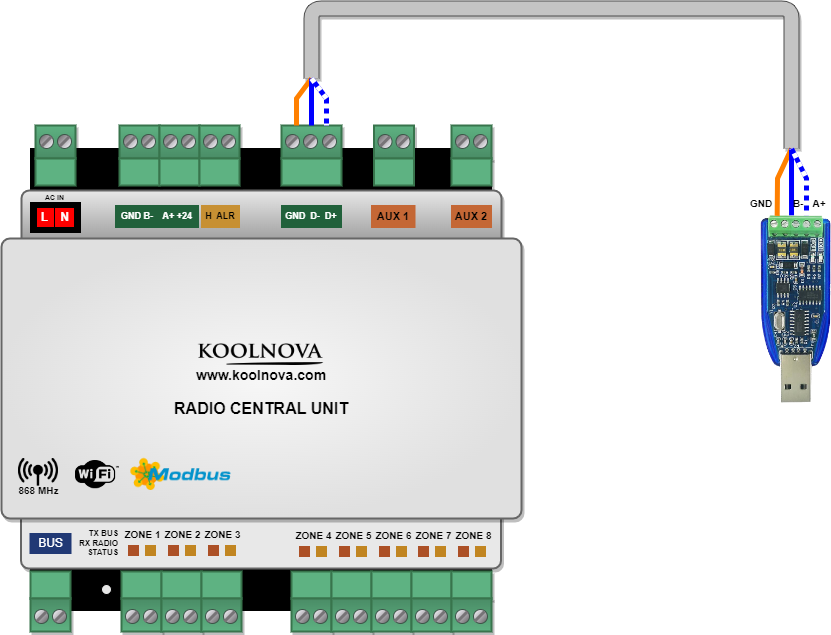

* Controller D+ to USB dongle A+
* Controller D- to USB dongle B-
* Controller GND to USB dongle GND

### with koolnova 100-CPND00 control unit and RS485 USB Dongle

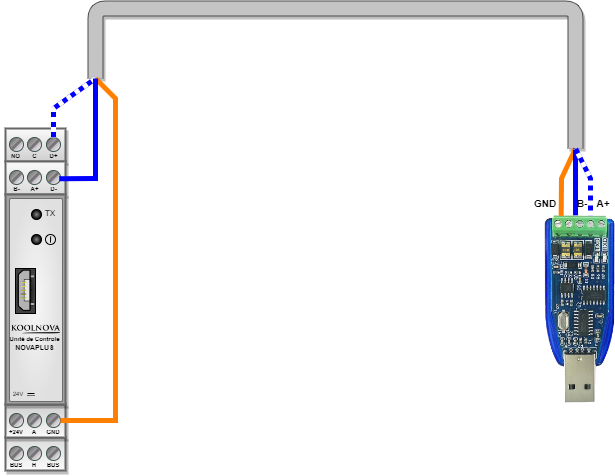

* Controller D+ to USB dongle A+
* Controller D- to USB dongle B-
* Controller GND to USB dongle GND

### with koolnova 100-CPNR00 control unit and RS485/WIFI device

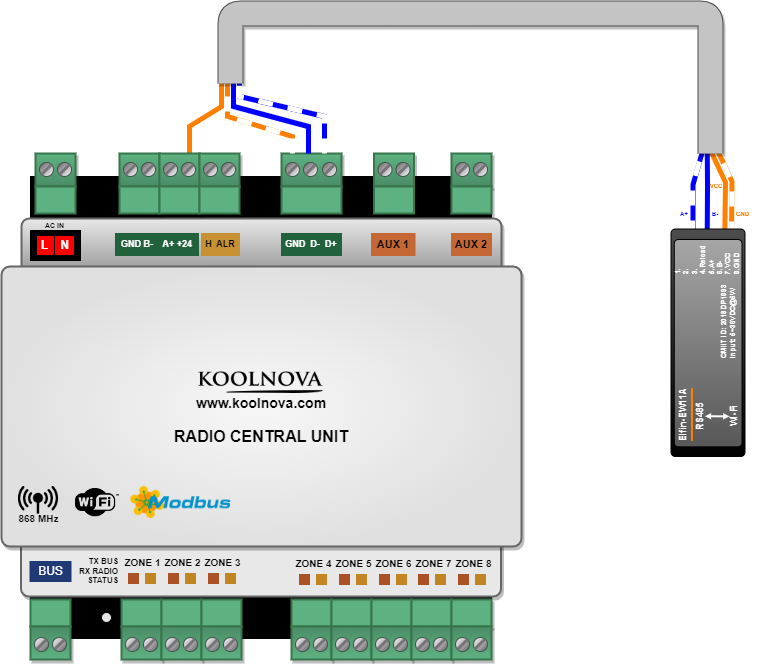

* Controller D+ to RS485/WIFI module A+
* Controller D- to RS485/WIFI module B-
* Controller GND to RS485/WIFI module GND
* Controller +24 to RS485/WIFI module VCC

## Installation

Install using HACS In HACS go to the three dots int the upper right corner choose add custom repository and add https://github.com/sinseman44/koolnova-BMS-Integration to the list.<br />
Install manually Clone or copy this repository and copy the folder `custom_components/koolnova_bms` into `/custom_components/koolnova_bms`.<br />

[](https://my.home-assistant.io/redirect/hacs_repository/?owner=sinseman44&repository=koolnova-BMS-Integration&category=integration)
[](https://my.home-assistant.io/redirect/config_flow_start/?domain=koolnova_bms)

## Home Assistant RS485/USB dongle recognition

After plugging the USB dongle into the system, check that among the tty, it's recognized by Home Assistant.<br />
Example : ttyUSB0 is the node added for the device. The absolute path of this node (eg: /dev/ttyUSB0) will be used in the component configuration.<br />

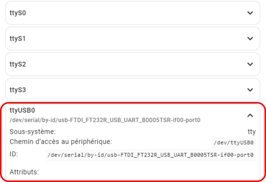

# Koolnova BMS Installation

The first page after installing the component is the choice of Modbus communication.
* Modbus TCP (for wireless system)
* Modbus RTU (for wired system)

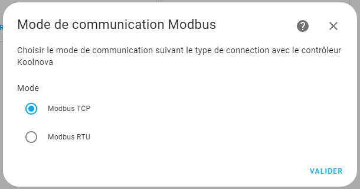

Depending on the choice made, the next step is the Modbus RTU configuration or the Modbus TCP configuration.<br />

## Koolnova RTU Installation

All serial fields are filled with default values defined by Koolnova.<br />
Adapt the fields according to your own configuration.<br />

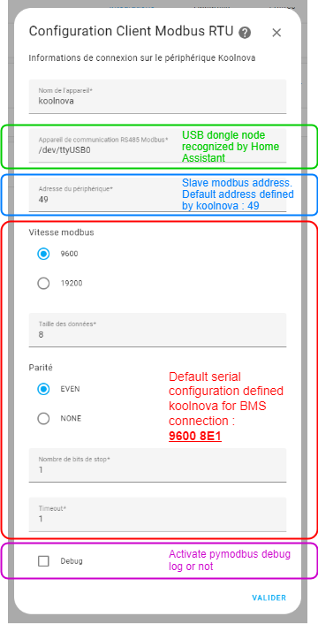

> [!NOTE]
> Each control unit has a specific address (default 49). Possible addresses are 1 to 247.

After validation of the serial configuation, the component will test if it can communicate with the koolnova system. If not, an error occur.<br />

> [!WARNING]  
> some users encountered a problem with the slave Modbus address. Enter address “1” instead of the default (49) and check if this validate this step.

## Koolnova TCP Installation

All fields are filled with default values.<br />
Adapt the fields according to your own configuration.<br />

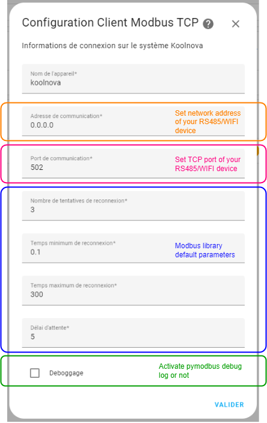

## Area installation

The next installation page is the area configuration.<br />
This page appears for each area that must be configured.<br />

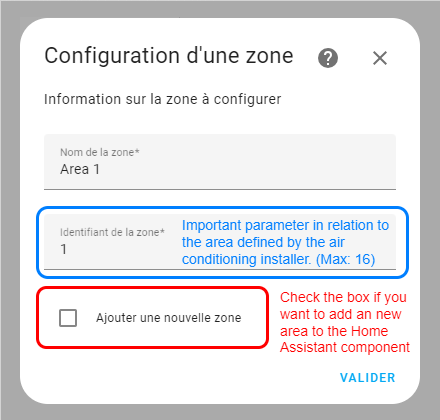

The checkbox must be filled before validation if you want to configure a new area.<br />
The area configuration ends with no new area.<br />

# Features

- Integrates local API to read/write Modbus koolnova registers
- Provides `climate` for each area, `sensor`, `select` and `switch`

## Climate

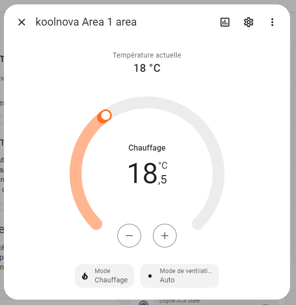

The following parameters can be controlled for the `climate` platform entities:
- Power
- Target temperature (celcius, Min: 15°C -> Max: 35°C)
- Operation mode (HVAC mode: Heating/Refeshing)
- Fan mode (HVAC mode)

## Sensor (Diagnostic)
### for RTU mode
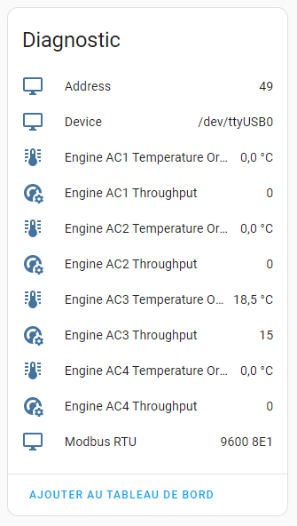

The following attributes are available for diagnostic `sensor` platform entities:
- Modbus serial (Device, Address, port, ...)
- Target temperature (celcius) and throughput for each engine (maximum 4):
  - Target temperature: Min: 15°C -> Max: 35°C
  - Troughput: int value between 0 (engine stopped) to 15 (maximum troughput)

- Target temperature (celcius) for each area:
  - 0°C to 50°C

### for TCP mode
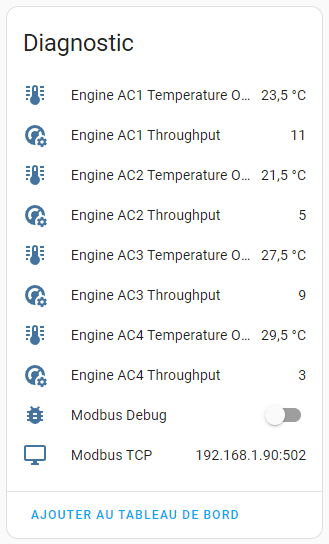

The following attributes are available for diagnostic `sensor` platform entities:
- Network settings (Address, port)
- Target temperature (celcius) and throughput for each engine (maximum 4):
  - Target temperature: Min: 15°C -> Max: 35°C
  - Troughput: int value between 0 (engine stopped) to 15 (maximum troughput)

- Target temperature (celcius) for each area:
  - 0°C to 50°C

## Select

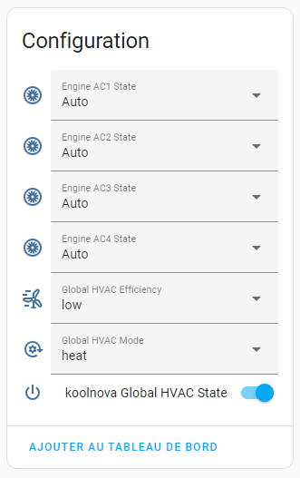

The following parameters can be controlled for the `select` platform entities:
- Global operation mode (HVAC mode)
  - cold
  - heat
  - heating floor (need a specific hardware module, identifier: 100-MSR002)
  - refreshing floor and refreshing air (need a specific hardware module, identifier: 100-MSR002)
  - heating floor and heating air (need a specific hardware module, identifier: 100-MSR002)

- Global efficiency defined the balance point between efficiency and speed of the area system.
  - Lower: the set temperature is reached sooner
  - Higher: better efficiency 

- Engine state: int value which represents the flow programming of the system engines
  - 1: Manual minimum
  - 2: Manual medium
  - 3: Manual high
  - 4: Automatic

## Switch

The following parameters can be controlled for the `switch` platform entitie:
- Global HVAC State (stopped or running)
- Modbus Debug (stopped or running)

# Debugging

Whenever you write a bug report, it helps tremendously if you indicate sufficient debug logs directly (otherwise we will just ask for them and it will take longer). So please enable debug logs like this and include them in your issue:
```yaml
logger:
  default: warning
  logs:
    custom_components.koolnova_bms: debug
```
