# koolnova-BMS-Integration

[](https://github.com/hacs/integration)
[](https://github.com/sinseman44/koolnova-BMS-Integration/blob/main/LICENSE)
[](https://github.com/sinseman44/koolnova-BMS-Integration/releases)
<br />

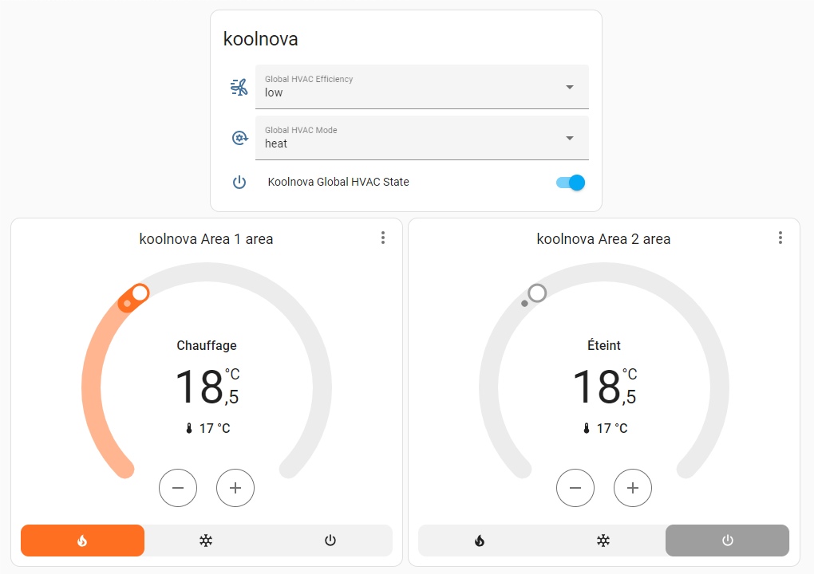

_Avertissement : cette intégration n'est pas une intégration officielle Koolnova. Utilisez-la à vos risques._

**koolnova-BMS-Integration** est une intégration du système Koolnova dans Home Assistant via BMS (Building Management System) et le protocole Modbus RTU (RS485).

> [!WARNING]
> Koolnova 1.0 et Koolnova 2.0 n'exposent pas toutes les fonctionnalités système de la même manière. Cette intégration prend en charge les deux versions avec un sélecteur de version et une détection automatique. Les entités avancées Koolnova 2.0 sont exposées progressivement et doivent encore être considérées comme de la configuration avancée tant qu'elles n'ont pas été validées sur davantage d'installations réelles.

## Building Management System (BMS)

Avec un BMS, les utilisateurs peuvent surveiller et piloter des systèmes comme la climatisation, le chauffage, la ventilation, l'éclairage ou l'alimentation en énergie.
La gestion technique du bâtiment vise notamment à améliorer le confort des occupants, optimiser le fonctionnement des systèmes, réduire la consommation d'énergie, limiter les coûts d'exploitation et de maintenance, et renforcer la sécurité.

La plupart des réseaux d'automatisation du bâtiment reposent sur un bus principal et un bus secondaire qui relient les contrôleurs de haut niveau aux contrôleurs de bas niveau, aux entrées/sorties, aux appareils et à l'interface utilisateur.
La connectivité physique entre les appareils a historiquement été assurée par fibre optique dédiée, ethernet, ARCNET, RS-232, **RS-485** ou des réseaux sans fil spécialisés à faible débit.

## Modbus RTU

**Modbus** est un protocole de communication client/serveur situé dans la couche application du modèle OSI. Modbus a été développé pour les applications industrielles ; il est relativement simple à déployer et à maintenir par rapport à d'autres standards, et impose peu de contraintes sur le format des données transmises.

Les supports de communication couramment utilisés avec Modbus sont :
* TCP/IP sur Ethernet
* Communication série asynchrone avec différents standards et technologies : EIA/TIA-232-E, EIA-422, EIA/TIA-485-A, fibre, radiofréquence.
* Modbus PLUS, un réseau haut débit à passage de jeton

Le standard Modbus définit MODBUS over Serial Line, un protocole de couche liaison de données qui permet d'utiliser Modbus sur un bus série. Le protocole Modbus Serial Line est de type maître/esclave et prend en charge un maître et plusieurs esclaves sur le bus série.
Un bus série Modbus peut permettre à un maître de communiquer avec un maximum de 247 esclaves, chaque esclave devant avoir une adresse unique entre 1 et 247.
Modbus over Serial Line dispose de deux modes de transmission, RTU et ASCII, correspondant aux deux versions du protocole appelées Modbus RTU et Modbus ASCII.

Modbus RTU (Remote Terminal Unit) utilise une représentation binaire compacte des données. Le format RTU ajoute aux commandes et aux données un contrôle CRC afin de vérifier la fiabilité de la transmission.

## Modbus TCP

Modbus TCP/IP (aussi appelé Modbus-TCP) correspond au protocole Modbus RTU avec une interface TCP qui fonctionne sur Ethernet.
Modbus TCP/IP utilise TCP/IP et Ethernet pour transporter les données des messages Modbus entre appareils compatibles. Il combine donc un réseau physique (Ethernet), un standard réseau (TCP/IP) et une méthode standardisée de représentation des données (Modbus comme protocole applicatif). En pratique, un message Modbus TCP/IP est un message Modbus encapsulé dans TCP/IP sur Ethernet.

# Support

<a href="https://www.buymeacoffee.com/sinseman44" target="_blank"></a>

# Todo et rapports de bug

Voir la [liste GitHub des tâches et bugs](https://github.com/sinseman44/koolnova-BMS-Integration/issues)

# Démarrage

## Architecture

Deux architectures sont possibles : une première architecture filaire où le système Koolnova est connecté au serveur Home Assistant via un dongle USB/RS485, et une seconde architecture sans fil où le système Koolnova est connecté à un appareil RS485/WIFI lui-même connecté au même réseau WIFI que le serveur Home Assistant.

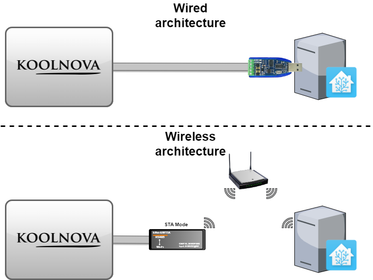

_Dans la terminologie IEEE 802.11 (Wi-Fi), une station (STA) est un appareil capable d'utiliser le protocole 802.11. Par exemple, une station peut être un ordinateur portable, un PC de bureau, un PDA, un point d'accès ou un téléphone Wi-Fi. Une STA peut être fixe, mobile ou portable._

## Prérequis

* Une installation Home Assistant avec un port USB libre.
* Un dongle USB RS485 (exemple : DSD Tech SH-U11) pour les systèmes filaires ou un appareil RS485/WIFI (exemple : Elfin EW11A ou Elfin EW11-0, [exemple de configuration](EW11-config.md)) pour les systèmes sans fil.
* Un système de climatisation Koolnova (identifiant : 100-CPNR00 ou 100-CPND00) avec des zones définies.
* La communication Modbus activée sur le thermostat radio maître (INT 49).
* Une version de système Koolnova sélectionnée pendant la configuration :
  * `Auto detect`
  * `Koolnova 1.0`
  * `Koolnova 2.0`

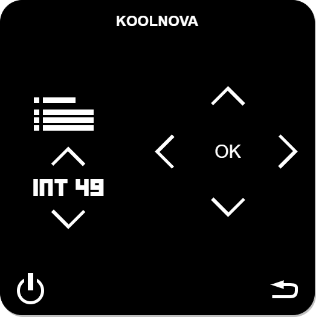

> [!WARNING]
> Si vous choisissez un appareil RS485/WIFI Elfin, il doit accepter une tension comprise entre ___5v et 36v___.

## Connexion

### avec une unité de contrôle koolnova 100-CPNR00 et un dongle USB RS485

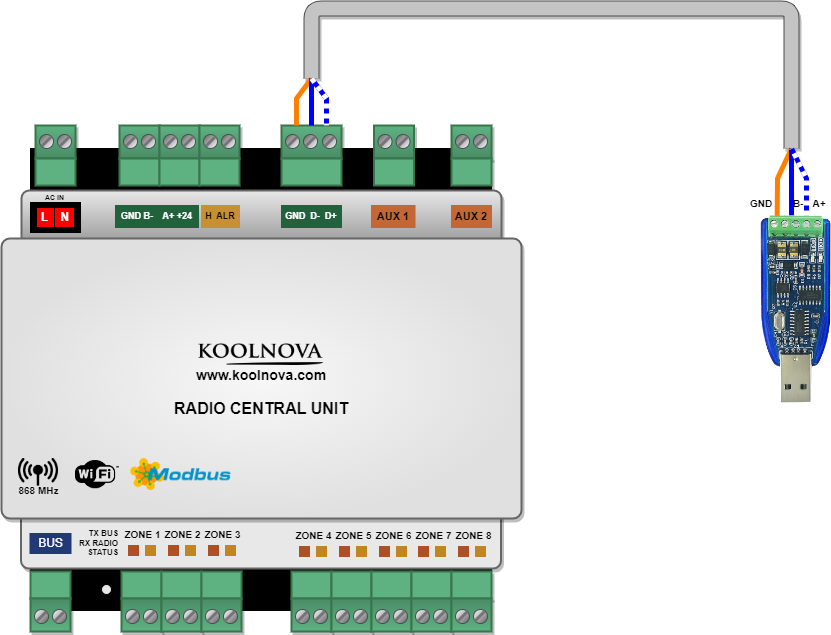

* Contrôleur D+ vers USB dongle A+
* Contrôleur D- vers USB dongle B-
* Contrôleur GND vers USB dongle GND

### avec une unité de contrôle koolnova 100-CPND00 et un dongle USB RS485

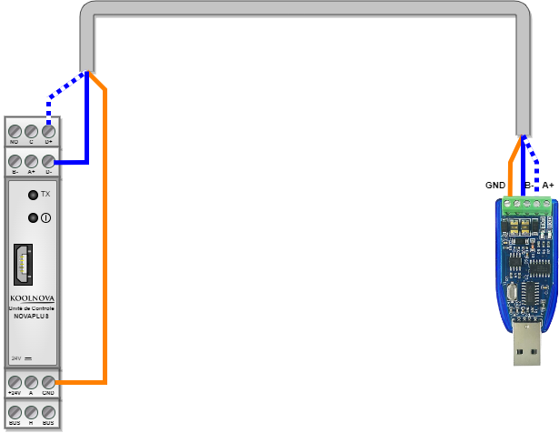

* Contrôleur D+ vers USB dongle A+
* Contrôleur D- vers USB dongle B-
* Contrôleur GND vers USB dongle GND

### avec une unité de contrôle koolnova 100-CPNR00 et un appareil RS485/WIFI

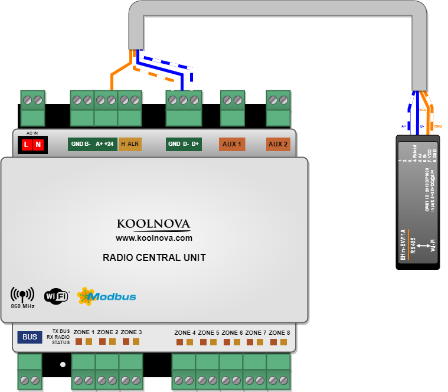

* Contrôleur D+ vers module RS485/WIFI A+
* Contrôleur D- vers module RS485/WIFI B-
* Contrôleur GND vers module RS485/WIFI GND
* Contrôleur +24 vers module RS485/WIFI VCC

## Installation

Installation via HACS : dans HACS, ouvrez le menu avec les trois points en haut à droite, choisissez l'ajout d'un dépôt personnalisé et ajoutez https://github.com/sinseman44/koolnova-BMS-Integration à la liste.<br />
Installation manuelle : clonez ou copiez ce dépôt puis copiez le dossier `custom_components/koolnova_bms` dans `/custom_components/koolnova_bms`.<br />

[](https://my.home-assistant.io/redirect/hacs_repository/?owner=sinseman44&repository=koolnova-BMS-Integration&category=integration)
[](https://my.home-assistant.io/redirect/config_flow_start/?domain=koolnova_bms)

## Reconnaissance du dongle RS485/USB dans Home Assistant

Après avoir branché le dongle USB au système, vérifiez qu'il est bien reconnu par Home Assistant parmi les périphériques tty.<br />
Exemple : ttyUSB0 est le nœud ajouté pour l'appareil. Le chemin absolu de ce nœud (par exemple /dev/ttyUSB0) sera utilisé dans la configuration du composant.<br />

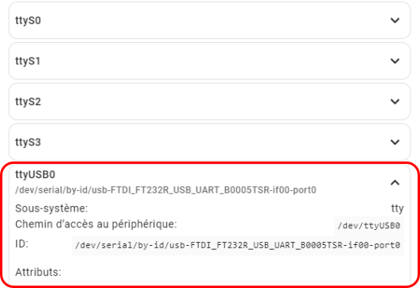

# Installation de Koolnova BMS

La première page après l'installation du composant permet de choisir le type de communication Modbus.
* Modbus TCP (pour les systèmes sans fil)
* Modbus RTU (pour les systèmes filaires)

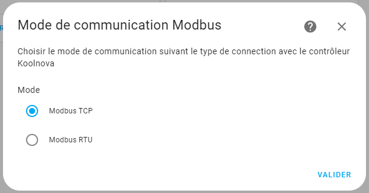

Selon le choix effectué, l'étape suivante est la configuration Modbus RTU ou la configuration Modbus TCP.<br />

## Installation Koolnova RTU

Tous les champs série sont pré-remplis avec les valeurs par défaut définies par Koolnova.<br />
Adaptez les champs à votre propre configuration.<br />

> [!IMPORTANT]
> Le nom de l'appareil est important si vous avez plusieurs contrôleurs Koolnova afin de les distinguer. Il doit être différent pour chaque instance de cette intégration.

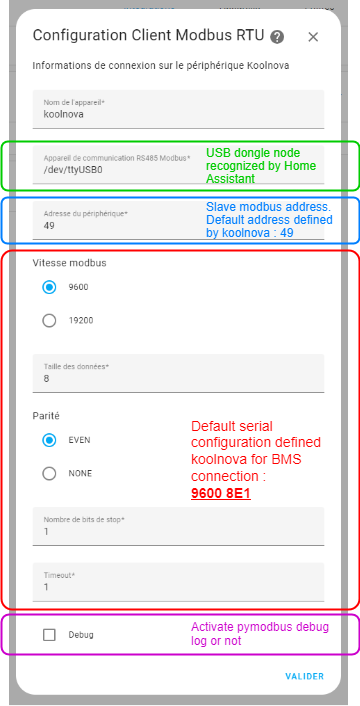

> [!NOTE]
> Chaque unité de contrôle possède une adresse spécifique (49 par défaut). Les adresses possibles vont de 1 à 247.

Après validation de la configuration série, le composant teste s'il peut communiquer avec le système Koolnova. Si ce n'est pas le cas, une erreur apparaît.<br />

> [!WARNING]  
> Certains utilisateurs ont rencontré un problème avec l'adresse Modbus esclave. Saisissez l'adresse “1” au lieu de la valeur par défaut (49) et vérifiez si cette étape est validée.

## Installation Koolnova TCP

Tous les champs sont pré-remplis avec les valeurs par défaut.<br />
Adaptez les champs à votre propre configuration.<br />

> [!IMPORTANT]
> Le nom de l'appareil est important si vous avez plusieurs contrôleurs Koolnova afin de les distinguer. Il doit être différent pour chaque instance de cette intégration.

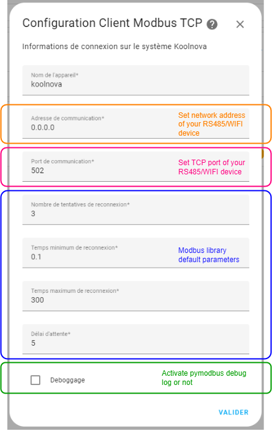

## Version du système Koolnova

Pendant la configuration, l'intégration demande quelle version du système Koolnova doit être utilisée.

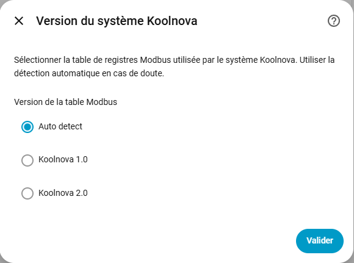

* `Auto detect` : l'intégration essaie d'identifier automatiquement la version du contrôleur.
* `Koolnova 1.0` : utilisez ce choix lorsque votre contrôleur est un système Koolnova 1.0.
* `Koolnova 2.0` : utilisez ce choix lorsque votre contrôleur est un système Koolnova 2.0. Cela active des diagnostics supplémentaires et des entités de configuration avancée.

> [!IMPORTANT]
> Si la détection automatique ne fonctionne pas sur votre installation, choisissez la version qui correspond à votre contrôleur Koolnova. Sélectionner la mauvaise version peut rendre les contrôles avancés incorrects.

## Installation des zones

La page suivante est la configuration des zones.<br />
Cette page apparaît pour chaque zone à configurer.<br />

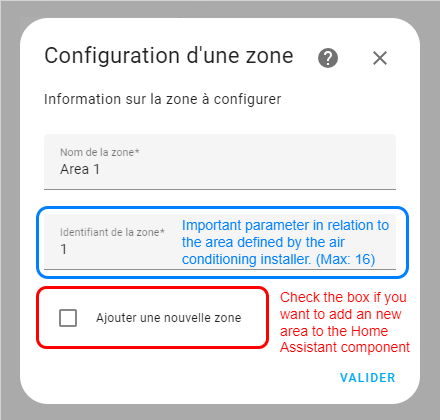

La case doit être cochée avant validation si vous voulez configurer une nouvelle zone.<br />
La configuration des zones se termine lorsqu'aucune nouvelle zone n'est ajoutée.<br />

# Fonctionnalités

- Interrogation locale via Modbus RTU ou Modbus TCP.
- Configuration depuis l'interface Home Assistant.
- Prise en charge de plusieurs contrôleurs lorsque chaque contrôleur possède un nom d'appareil et une connexion Modbus uniques.
- Sélection de version Koolnova 1.0 ou Koolnova 2.0, avec détection automatique.
- Entités `climate` pour les zones configurées.
- Entités `sensor`, `number`, `select` et `switch` pour les diagnostics et la configuration.
- Services avancés Koolnova 2.0 pour envoyer et consulter les commandes d'angle d'ouverture par zone.
- Les contrôles système Koolnova 2.0 utilisent le modèle de communication adapté à cette version.

## Climate

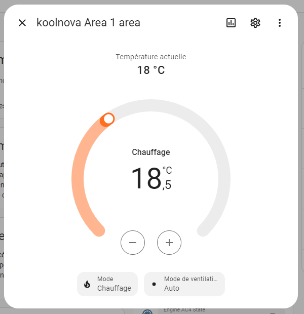

Les paramètres suivants peuvent être contrôlés via les entités de la plateforme `climate` :
- Marche/arrêt de la zone.
- Température de consigne (Celsius, Min : 15°C -> Max : 35°C).
- Mode de ventilation :
  - Auto
  - Off
  - Low
  - Medium
  - High
- Le mode HVAC d'une zone suit le `Global HVAC mode` du contrôleur.

Le système Koolnova utilise un mode chauffage/refroidissement global au contrôleur. Les entités `climate` de zone permettent d'allumer ou d'éteindre une zone, de régler la température de consigne et la ventilation, mais le passage du refroidissement au chauffage se fait via l'entité `select` `Global HVAC mode`.

## Sensor (Diagnostic)
### en mode RTU
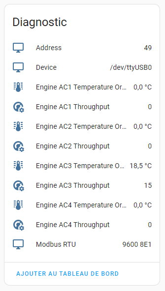

Les attributs suivants sont disponibles via les entités de diagnostic de la plateforme `sensor` :
- Informations Modbus série (appareil, adresse, port, ...)
- Température de consigne et débit pour chaque moteur (maximum 4) :
  - Température de consigne : Min : 15°C -> Max : 35°C
  - Débit : valeur entière entre 0 (moteur arrêté) et 15 (débit maximum)

- Température de consigne pour chaque zone :
  - 0°C à 50°C

### en mode TCP
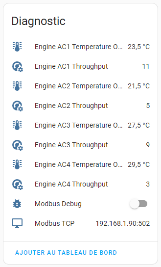

Les attributs suivants sont disponibles via les entités de diagnostic de la plateforme `sensor` :
- Paramètres réseau (adresse, port)
- Température de consigne et débit pour chaque moteur (maximum 4) :
  - Température de consigne : Min : 15°C -> Max : 35°C
  - Débit : valeur entière entre 0 (moteur arrêté) et 15 (débit maximum)

- Température de consigne pour chaque zone :
  - 0°C à 50°C

### Capteurs de diagnostic Koolnova 2.0

Lorsque Koolnova 2.0 est sélectionné, des capteurs de diagnostic supplémentaires sont créés :

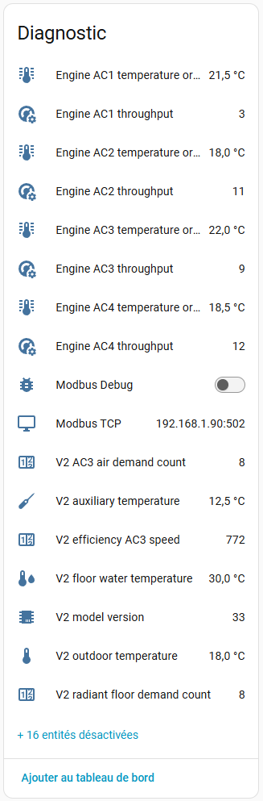

- Modèle/version de l'unité de contrôle.
- Champs de diagnostic de l'heure système.
- Température de l'eau du plancher.
- Température extérieure.
- Température NTC auxiliaire.
- Nombre de demandes de plancher chauffant.
- Nombre de demandes d'air AC3.
- Volume connecté et volume actif pour AC1 à AC4.
- Moyenne de température demandée pour AC1 à AC4.
- Valeurs brutes/réservées qui ne sont pas suffisamment sûres pour être exposées comme contrôles utilisateur.

Certaines entités de diagnostic avancées ou bruyantes sont désactivées par défaut et peuvent être activées depuis le registre d'entités Home Assistant si nécessaire.

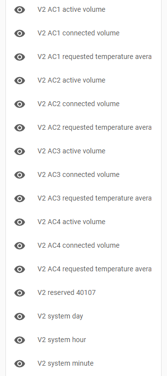

## Select

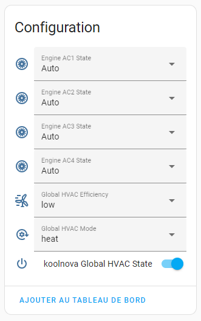

Les paramètres suivants peuvent être contrôlés via les entités de la plateforme `select` :
- Mode de fonctionnement global (mode HVAC)
  - ventilation (Koolnova 2.0)
  - cold
  - heat
  - dehumidification (Koolnova 2.0)
  - heating floor (nécessite un module matériel spécifique, identifiant : 100-MSR002)
  - refreshing floor and refreshing air (nécessite un module matériel spécifique, identifiant : 100-MSR002)
  - heating floor and heating air (nécessite un module matériel spécifique, identifiant : 100-MSR002)

- Efficacité globale, lorsque le contrôleur la prend en charge, qui définit l'équilibre entre efficacité et rapidité du système par zone.
  - Lower : la température de consigne est atteinte plus rapidement
  - Higher : meilleure efficacité

- État du moteur : valeur entière représentant la programmation de débit des moteurs du système
  - 1 : Manual minimum
  - 2 : Manual medium
  - 3 : Manual high
  - 4 : Automatic

### Selects avancés Koolnova 2.0

Lorsque Koolnova 2.0 est sélectionné, l'intégration expose aussi des selects de configuration avancée :

- Réglage EFI.
- Modes cibles de bascule automatique :
  - mode à appliquer au-dessus du seuil d'eau chaude
  - mode à appliquer sous le seuil d'eau froide
- Codes de fonction des entrées externes DIN1 et DIN2.
- Niveau de blocage thermostat.
- Facteur de sécurité de la vanne mélangeuse.
- Modes refroidissement et chauffage de la vanne mélangeuse.

Certaines options restent numériques car la documentation publique ne fournit pas toujours un libellé utilisateur confirmé.

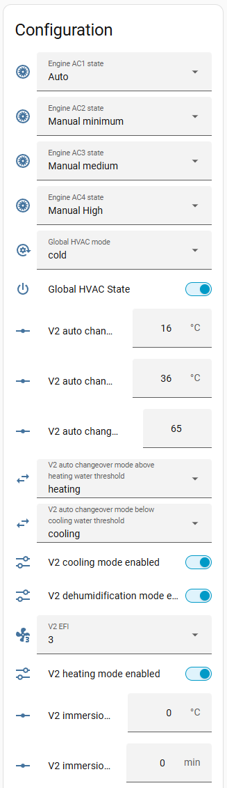

## Number

La plateforme `number` est utilisée pour les valeurs de configuration numériques. Koolnova 2.0 ajoute les entités avancées suivantes :

- Limites de température de chauffage et de refroidissement.
  - Ces limites utilisent un pas de 0,5 C.
- Seuils d'eau pour la bascule automatique.
- Seuil du relais d'humidité pour la bascule automatique.
- Temporisation de pompe.
- Ajustement de l'origine de vanne.
- Temporisation d'activation et température d'activation de la résistance d'appoint.
- Limites de température ambiante de la vanne mélangeuse.
- Limites de température d'eau de la vanne mélangeuse.
- Températures fixes de départ froid/chaud de la vanne mélangeuse.

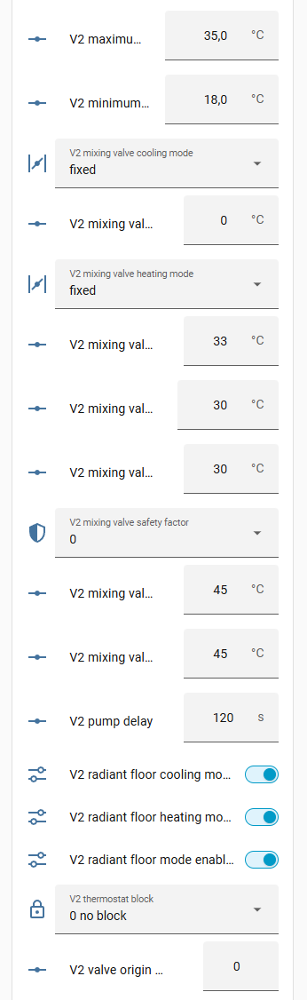

### Bascule automatique Koolnova 2.0

Les réglages de bascule automatique Koolnova 2.0 combinent les seuils de température d'eau avec les modes à appliquer lorsque ces seuils sont atteints :

- seuil refroidissement / plancher rafraîchissant, utilisé lorsque la température d'eau mesurée est inférieure ou égale à la valeur configurée.
- seuil chauffage / plancher chauffant, utilisé lorsque la température d'eau mesurée est supérieure ou égale à la valeur configurée.
- mode cible au-dessus du seuil d'eau chaude.
- mode cible sous le seuil d'eau froide.
- seuil du relais d'humidité.

Dans Home Assistant, ces valeurs sont exposées sous forme d'entités `select` et `number` distinctes, mais elles doivent être configurées ensemble. Modifier uniquement les seuils sans vérifier les modes cibles, ou modifier les modes cibles sans vérifier les seuils, peut rendre le mode automatique inattendu.

## Switch

Les paramètres suivants peuvent être contrôlés via les entités de la plateforme `switch` :
- État HVAC global (arrêté ou en fonctionnement)
- Debug Modbus (arrêté ou en fonctionnement)

### Switches avancés Koolnova 2.0

Lorsque Koolnova 2.0 est sélectionné, l'intégration expose aussi :

- Switches de disponibilité des modes utilisés par le sélecteur global de mode HVAC :
  - ventilation
  - cooling
  - heating
  - dehumidification
  - radiant floor
  - radiant floor cooling
  - radiant floor heating
- Switches d'activation des électrovannes pour chaque zone configurée.

> [!NOTE]
> Le nombre d'entités `V2 Zx - Area X electrovalve enabled` dépend du nombre de zones configurées pendant la configuration de l'intégration.

Ces entités écrivent des valeurs de configuration avancées Koolnova 2.0. Utilisez-les uniquement si vous comprenez le comportement correspondant du contrôleur.

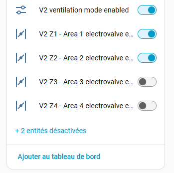

## Services avancés Koolnova 2.0

L'intégration fournit des services avancés pour les commandes d'angle d'ouverture Koolnova v2 :

- `koolnova_bms.set_v2_opening_angle` : envoyer la commande d'angle d'ouverture pour une zone.
- `koolnova_bms.get_v2_last_opening_angle` : retourner la dernière zone cible et la dernière commande d'angle.

Ces commandes sont exposées comme services plutôt que comme états par zone, car le contrôleur ne remonte que la dernière commande d'angle d'ouverture, et non une valeur persistante par zone.

Champs des services :

- `zone_id` : numéro de zone Koolnova, de 1 à 16.
- `angle` : angle d'ouverture, parmi 45, 60, 75 ou 90.
- `entry_id` : identifiant optionnel de l'entrée de configuration Home Assistant, requis uniquement lorsque plusieurs contrôleurs Koolnova v2 sont chargés.

Pour `get_v2_last_opening_angle`, `zone_id` est optionnel. Lorsqu'il est fourni, la réponse indique si la dernière commande cible actuellement cette zone.

# Débogage

Lorsque vous ouvrez un rapport de bug, il est très utile d'inclure directement des logs de debug suffisants ; sinon, ils vous seront demandés et cela ralentira le traitement. Activez donc les logs de debug comme ceci et joignez-les à votre issue :
```yaml
logger:
  default: warning
  logs:
    custom_components.koolnova_bms: debug
```
