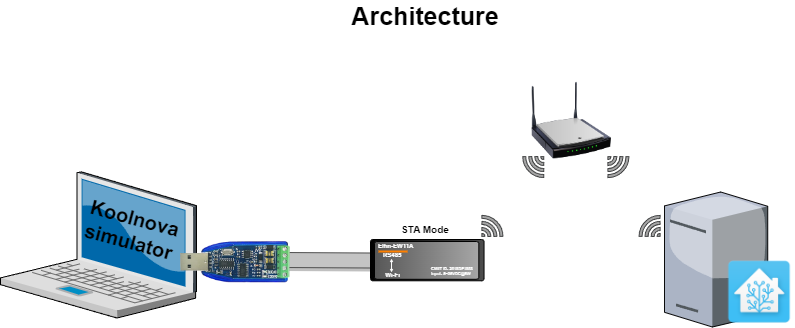

# Koolnova RTU Simulator



```
usage: koolnova_simulator.py [-h] [--log {critical,error,warning,info,debug}] [--config CONFIG] [--profile {v1,v2}]

Run koolnova simulator.

optional arguments:
  -h, --help            show this help message and exit
  --log {critical,error,warning,info,debug}
                        set log level, default is info
  --config CONFIG       JSON Config path file
  --profile {v1,v2}     built-in Koolnova Modbus table profile, default is v1
```

## Dependencies

The simulator is validated with `pymodbus[serial]==3.13.0`.

The code keeps compatibility with `pymodbus==3.9.2`, but `pymodbus 3.13.0` emits deprecation warnings for `ModbusSimulatorContext` and `ModbusServerContext`. These APIs are still usable in 3.13.0 but are announced for removal in pymodbus v4.

## Koolnova 1.0 profile

`server.json` simulates the current Koolnova 1.0 table.

Important registers:

| Logical address | Offset | Meaning |
| --------------- | -----: | ------- |
| 40073 | 72 | AC1 airflow programming, values 1 to 4. Auto-detection should classify this profile as `v1`. |
| 40081 | 80 | Global system on/off. |
| 40082 | 81 | Global machine mode. |

Example :<br />
```
Koolnova-Simulator|⇒  python3 koolnova_simulator.py --log=debug --profile v1

2024-11-05 19:50:56,447 DEBUG transport:250 Awaiting connections server_listener
2024-11-05 19:50:56,459 INFO  async_io:301 Server listening.
2024-11-05 19:50:56,460 DEBUG transport:270 Connected to server
2024-11-05 19:52:26,303 DEBUG transport:322 recv: 0x1 0x3 0x0 old_data:  addr=None
2024-11-05 19:52:26,303 DEBUG async_io:123 Handling data: 0x1 0x3 0x0
2024-11-05 19:52:26,303 DEBUG base:92 Processing: 0x1 0x3 0x0
2024-11-05 19:52:26,303 DEBUG rtu:105 Short frame: 0x1 0x3 0x0 wait for more data
2024-11-05 19:52:26,319 DEBUG transport:322 recv: 0x50 0x0 0x1 0x84 0x1b old_data:  addr=None
2024-11-05 19:52:26,319 DEBUG async_io:123 Handling data: 0x1 0x3 0x0 0x50 0x0 0x1 0x84 0x1b
2024-11-05 19:52:26,319 DEBUG base:92 Processing: 0x1 0x3 0x0 0x50 0x0 0x1 0x84 0x1b
2024-11-05 19:52:26,319 DEBUG decoders:103 decode PDU for 3
2024-11-05 19:52:26,319 DEBUG base:102 Frame advanced, resetting header!!
2024-11-05 19:52:26,320 DEBUG transport:379 send: 0x1 0x3 0x2 0x0 0x1 0x79 0x84
2024-11-05 19:52:35,733 DEBUG transport:322 recv: 0x1 0x3 0x0 0x8 0x0 old_data:  addr=None
2024-11-05 19:52:35,733 DEBUG async_io:123 Handling data: 0x1 0x3 0x0 0x8 0x0
2024-11-05 19:52:35,733 DEBUG base:92 Processing: 0x1 0x3 0x0 0x8 0x0
2024-11-05 19:52:35,733 DEBUG rtu:115 Frame - not ready
2024-11-05 19:52:35,751 DEBUG transport:322 recv: 0x4 0xc5 0xcb old_data:  addr=None
2024-11-05 19:52:35,752 DEBUG async_io:123 Handling data: 0x1 0x3 0x0 0x8 0x0 0x4 0xc5 0xcb
2024-11-05 19:52:35,752 DEBUG base:92 Processing: 0x1 0x3 0x0 0x8 0x0 0x4 0xc5 0xcb
2024-11-05 19:52:35,752 DEBUG decoders:103 decode PDU for 3
```

## Koolnova 2.0 profile

`server-v2.json` simulates the Koolnova 2.0 table layout.

Important registers:

| Logical address | Offset | Meaning |
| --------------- | -----: | ------- |
| 40073 | 72 | Control unit model/software version. The sample value is `0x0021`; auto-detection should classify this profile as `v2`. |
| 40075 | 74 | Active modes bitmask. The sample value is `0x007F`, enabling ventilation, cooling, heating, dehumidification, radiant floor, floor cooling and floor heating. |
| 40076 | 75 | Temperature limits. The sample value is `0x2312`, max heating 35 C and min cooling 18 C. |
| 40077 | 76 | Automatic changeover and humidity. The sample value is `0x2141`, heating above threshold, cooling below threshold, humidity threshold 65. |
| 40078 | 77 | System time. The sample value is `0x0BED`, matching the vendor example Monday 15:45. |
| 40081 | 80 | Opening angle Z9 to Z16, not global on/off. |
| 40082 | 81 | Radiant floor water temperature in tenths of degrees, randomized from 30.0 C to 45.0 C. |
| 40109 | 108 | Global system on/off. |
| 40110 | 109 | Global machine mode. |
| 40126 | 125 | MSB EFI and LSB AC3 speed. The sample value is `0x0304`, EFI 3 and AC3 speed 4. |

Example :<br />
```
Koolnova-Simulator|⇒  python3 koolnova_simulator.py --log=debug --profile v2
```

The v2 profile keeps zone registers 40001 to 40064 compatible with v1, but moves the system block to the v2 offsets documented by Koolnova.

Use `--config path/to/file.json` to load an explicit custom simulator file instead of the built-in profile.

## Correlated registers

The simulator applies a small Koolnova behavior layer on top of the static JSON datastore:

| Write target | v1 offset | v2 offset | Simulator effect |
| ------------ | --------: | --------: | ---------------- |
| Global system on/off | 80 | 108 | Updates the on/off bit of all registered zones. |
| Global HVAC mode | 81 | 109 | Updates the climate-mode nibble of all registered zones. |
| Zone on/off register | `4 * zone` | `4 * zone` | Updates the global system state to on if any registered zone is on, otherwise off. |
| Zone fan/mode register | `4 * zone + 1` | `4 * zone + 1` | Updates the global HVAC mode and mirrors that mode to all registered zones. |

This keeps the simulator aligned with gainable behavior: heating/cooling is controller-wide, while zones are only enabled or disabled individually.
